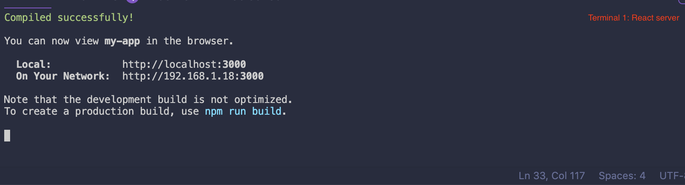
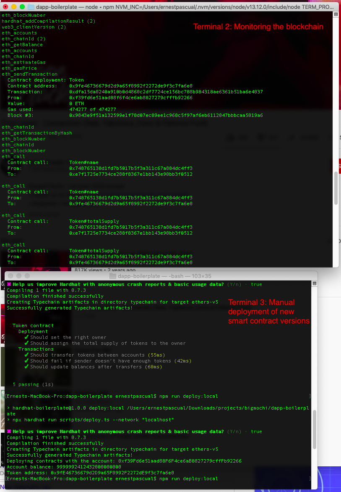

# Setup checklist

[ ] Clone UMA protocol from

# Setup environment variables

1. Go to https://infura.io/ and make an account
2. Paste the kovan project ID into your .env as the value for `INFURA_PROJECT_ID` key
3. Generate a 12 word mnemonic seed phrase (can use ganache to get one or ask project admin for current seed used for remote envs)
4. Paste 12 word mnemonic seed phrase as value for `MNEMONIC_SEED` key
5. Go to https://alchemyapi.io/ and setup an account then take the api key for the relevant network (like mainnet, kovan or ropsten) or ask the team for an existing API key and paste under `ALCHEMY_KEY`

# Metamask

1. Be sure to have metamask plugin installed in your browser (recommended browser is Chrome)
2. Login to Metamask and point the network to localhost and port 8545 before starting the frontend app

## Quickstart

1. Clone the uma protocol from the halodao protocol `git clone https://github.com/HaloDAO/protocol.git`
2. Run `git clone https://bitbucket.org/bigmochi/phpm-minter-demo && cd dapp-boilerplate`
3. run `npm i` to install backend dependencies (or just run `npm start` to skip steps 3,4,5 and 8)
4. Run `npm run compile` to generate typchain typings (skip if you ran `npm start` at #2)
5. Run `npm test` to run contract test suite to run smart contract test cases (skip if you ran `npm start` at #2)
6. Open another terminal and go inside the protocol folder of uma. Run `yarn` to install packages.
7. Run `yarn qbuild` to build smart contracts
8. Open ganache `npx ganache-cli -p 9545 -e 1000000 -l 10000000`
9. Open another terminal and enter the uma protocol folder again. Run the truffle console `yarn truffle console --network test`
10. Migrate contracts by running `migrate` inside truffle.
11. Do parameterize and deploy a contract steps 1- 10 and create new tokens from existing contract step 1 from this [guide in UMA documentation](https://docs.umaproject.org/build-walkthrough/mint-locally)
12. on another terminal, go back to the phpm-minter-demo run `npm run start:fe` to compile the minter contract and launch minter dApp

## Environment Setup

#### Quickstart Setup

- [ ] Install all dependencies
- [ ] Deployed a local ethereum network with HardHat Nework
- [ ] Compliled and deployed smart contract to the blockchain
- [ ] Contract artifact and typechain is auto generated in the front end folder

#### Terminal Setup Checklist

- [ ] Terminal 1 - React Front End for the dapp \
       
- [ ] Terminal 2 - For local development: Hardhat network / Ganache depoloyed in port 8545, debugging in the blockchain
- [ ] Terminal 3 (Optional) - Use to deploy new version of the smart contract in the blockchain after configuring it
      

#### Dapp Setup Checklist

- [ ] Deploy a local ethereum network with hardhat network or ganache / determine test network to test
- [ ] Metamask set to the network you are developing to (localhost:8545 for local, testnet of choice)
- [ ] Run a local react server

#### Smart Contract Development Setup Checklist

- [ ] Contract and other dependencies are in the same folder

## Tutorials

#### Deploying contracts in Kovan Testnet

1. Ensure you have added the following env variables: INFURA_PROJECT_ID and MNEMONIC SEED
2. Make sure the account in your mnemonic seed has enough balance to deploy the contract
3. Run `npm test` to ensure all tests are passing
4. If tests are passing, deploy the code by running `npm run deploy:kovan`
5. The token address should be shown in the console.
6. Run your dApp: `cd frontend && npm run start`
7. Change your metamask network to Kovan
8. The token details, network name (Kovan in this case) and contract address should be displayed in the UI

#### Local developlment: How to update the smart contract code w/ hot reloading

1. Do updates in the smart contract solidity code in the contracts folder located in root
2. Add tests in the test folder when necessary
3. Run `npm test`
4. If tests are passing, deploy the code by running `npm run deploy:local`
5. If successful, the front end dApp should reload and smart contract changes can be read/utilized by the dApp.

#### Testnet development: How to update the smart contract code w/ hot reloading

1. Do updates in the smart contract solidity code in the contracts folder located in root
2. Add tests in the test folder when necessary
3. Run `npm test`
4. If tests are passing, deploy the code by running `npm run deploy:kovan`
5. If successful, the front end dApp should reload and smart contract changes can be read/utilized by the dApp.

#### Resources

[HardHat Documentation](https://hardhat.org/getting-started/) - Hardhat tutorials, config, network, and plugin references
[scaffold-eth speeeeedrun](https://www.youtube.com/watch?v=eUAc2FtC0_s) - Similar workflow we can use in working with this boilerplate. Our boilerplate seemed to be an improved typescript version of this stack.

## Troubleshooting

1. Error: Cannot use JSX unless the '--jsx' flag is provided

- Follow: https://vscode.readthedocs.io/en/latest/languages/typescript/#using-the-workspace-version-of-typescript - "Using the workspace version of TypeScript" section

2. Warning: Calling an account which is not a contract

- Compile and deploy your contract first. Run `npm run deploy:local` for local deployments.

3. If you get `ProviderError: Must be authenticated!` or https://hardhat.org/errors/#HH604 then make sure you've entered a key and value in `.env` for `ALCHEMY_KEY`
